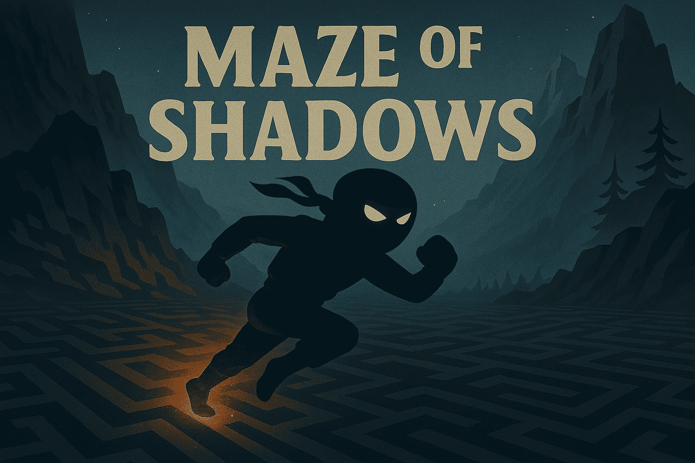

<div align="center">
  <h1>MAZE-of-SHADOWS</h1>
</div>

---
A 2D side-scrolling ninja action game built with C and [iGraphics](https://github.com/mahirlabibdihan/Modern-iGraphics). It was developed as a Level-1 Term-1 project for the CSE102 course.
---

<!--Banner Image-->
<div align="center">
    
</div>

---
⚙️ Setup Guide
---

Download the ZIP file  from [here](https://github.com/12402111/mAze-of-shadows/archive/refs/heads/main.zip) and run the MAZE-of-SHADOWS.exe file to play.

**or**

Clone the repository-
```bash
git clone https://github.com/12402111/mAze-of-shadows.git
cd MAZEofSHADOWS
```

Run the game using the following command in the terminal or openning the runner.bat file
```bash
.\runner.bat
```


---
🎮 Gameplay 
---

Navigate through the help menu to learn all the controls and jump into the game which can be played in three different modes!

**GamePlay**


https://github.com/user-attachments/assets/1f3a951c-b28e-4d26-abbc-3ed439c45a6e


---

## 🧑‍💻Develpers
---
[MD. Imtiaz Rahman.](https://github.com/IMTIAZ-2271)

[Niloy Das](https://github.com/12402111)


## 📚Supervised by
---

Sumaiya Sultana Any.
---


